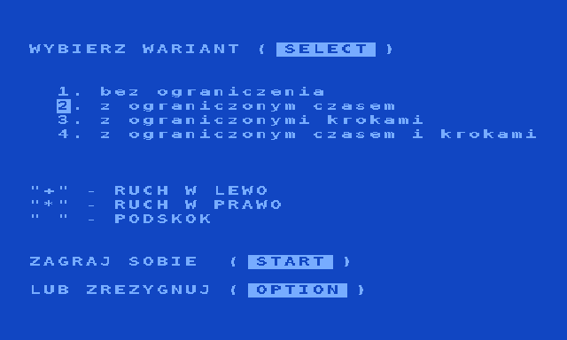
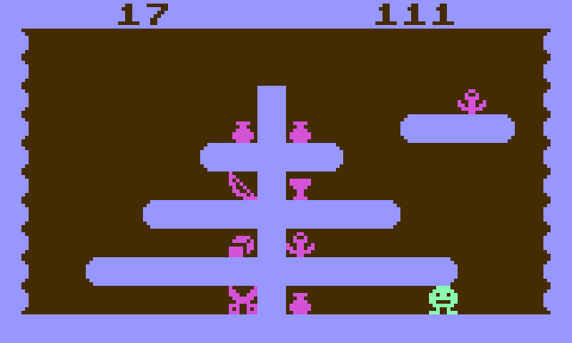

# FAC (Atari 8-bit, 1992) — conversion pipeline

Clean reconstruction of J.B. Wiśniewski's *FAC* as published in
**Tajemnice ATARI 2/92** (type-in Atari BASIC listing). Goal: a faithful,
deterministic engine in Python and a pygame front end, the same method as
[Heartlight](https://github.com/Quaerendir/Heartlight).

Original game: J.B. Wiśniewski, (C) 1992 Tajemnice ATARI.
Conversion (extraction, specification, engine, front end): **Quaerendir**.

*Pomyśl i zbierz wszystkie skarby.* A 20×12 platform puzzle: walk (`+` `*`),
jump (space), collect the treasures, mind the trapdoors that look like walls,
the elevators, the poison carpets, and never fall more than twice your height.
Four variants: free, time limit, step limit, both. Eleven levels.

 

## Files

| file | what |
|------|------|
| `2_92_fac.html` | the magazine article with the listing (source: unofficial TA archive, Pixel 2001) |
| `FAC.LST` | **the reference listing**: the program as LISTed by Atari BASIC (ATASCII), from `2_92.atr` in the archive's `2_92_listingi.zip` |
| `FAC.bas` | the listing as UTF-8 text taken from the HTML; lossy, kept for the diff (see below) |
| `fac_extract.py` | stage 1: reads the listing the way its own READ/RESTORE do, writes the files below |
| `levels.txt` | 11 levels, 20×12, with `x y treasures time steps`, elevator lists and colours |
| `meta.json` | colours, parameters, elevator lists, the 36-note tune, charset layout, key codes |
| `charset.bin` | 208 bytes: the 26 redefined glyphs from DATA 1010..1140 (`--glyphs` prints them) |
| `SPEC.md` | engine specification, every rule traced to a BASIC line number |
| `fac/engine.py` | stage 3: the engine, a literal re-implementation of the main loop L200..L725 |
| `tests/test_engine.py` | acceptance tests T1–T13 from `SPEC.md` §9 plus the real levels and a fuzz test |
| `fac/render.py` | stage 4: GRAPHICS 18/0 rendering, the live charset, POKEY channel 1, the timed sequences |
| `fac/play.py` | stage 4: the playable game (`fac` / `python -m fac.play`) |
| `fac/data/` | copies of `levels.txt`, `meta.json`, `charset.bin` shipped inside the package |
| `tools/line_codes.py` | the magazine's two-letter line codes (Generator Kodów Kontrolnych, TA 2/91) for any listing |
| `tools/screenshots.py`, `docs/*.png` | screenshots rendered from the extracted data |

## Why the LST and not the HTML

The archive's HTML page is what a text conversion of the ATASCII file left:
the six inverse-video treasure characters `$A4..$A9` came out as the CP852
letters `Ą ą Ž ž Ę ę`, the control characters of the menu strings and the REM
in line 50 were dropped, and **the thirteen DATA lines holding the redefined
character set (1010..1140) are empty**. The same archive ships the listings of
each issue as an ATR disk image; `FAC.LST` from it is byte-exact and the
archive notes that every listing was verified with the magazine's two-letter
line codes ("Generator Kodów Kontrolnych", TA 2/91). That check is repeated
here: `tools/line_codes.py` implements the code (recovered from the
generator's machine code: `Σ i·byte_i mod 676`, quotient and remainder by 26
as letters) and `tests/test_extract.py` compares it with the codes printed
beside the listing, read from the scan (archive.org,
`tajemnice-atari-1992-02`, p. 18) for the thirteen charset lines and their
neighbours: all agree.

```
python3 fac_extract.py FAC.LST --check FAC.bas
FAC.bas vs FAC.LST: 20 lines differ
  line 50: 21 control/inverse bytes dropped   ... lines 60..105 likewise
  line 1010: differs                          ... the 13 charset lines
```

## Usage

```
python3 fac_extract.py FAC.LST [--check FAC.bas] [--glyphs]   # -> levels.txt meta.json charset.bin
pip install pytest hypothesis mypy
python3 -m pytest -q          # 55 tests
python3 -m mypy fac/          # strict
```

```
pip install pygame-ce
python3 -m fac.play [--scale 3] [--level 1] [--variant 1-4] [--no-sound] [--no-intro] [--os-font FILE]
```
The game starts as the original does: the charset-loading intro with its
falling tone, then the GRAPHICS 0 menu. Menu: SELECT = F3 or Tab, START = F4
or Enter, OPTION = F2 or Esc (quits). In game: `+` or left arrow or A = left,
`*` or right arrow or D = right, space or up or W = jump, HELP = F6 or H (back
to the menu, the level is kept, as in the original). Q quits. The intro text
and the menu use the Atari OS character set, which is not part of this
repository: pass `--os-font FILE` (a 1 KB charset dump or an XL/OS-B ROM
image, or set `FAC_OS_FONT`) for a pixel-exact rendering, otherwise a system
font stands in. The level screen needs nothing but `charset.bin`.

```python
from fac import Engine, Key, Variant, parse_levels
e = Engine(parse_levels(open('levels.txt').read()), Variant.TIME_STEPS)
events = e.tick(Key.LEFT)     # one pass of the main loop; e.screen, e.state
```

## "I walked into a treasure and died"

You did not: you walked into what is behind it. Entering **any** non-empty
cell is fatal in the original, on foot (line 615, `IF K>0 THEN 650`) and in
the air (line 595); walls do not stop the hero, they kill it. A treasure is
the one exception, because the points routine (lines 360–385) leaves `K=0`
after collecting it. In level 1 the treasures sit right next to the trunk of
walls:

```
*       )/%        +      row 10
   ... (11,10) -> (10,10): treasure collected
                  (9,10): wall '/' -> death
```

so after a treasure you have to stop or turn. It feels "too fast" because
of the key auto-repeat: the XL/XE OS repeats a held key every 120 ms after
a delay of about a second, the game reads it on every pass of its loop, so
a held direction marches the hero straight into the wall. The front end
reproduces that (`pygame.key.set_repeat(960, 120)`), and also the key
buffer: a key pressed in the air is remembered (like register 764) and
acted on when the hero lands. The article says it: *stawiaj kroki
rozważnie*, and the step-limited variant counts every one of them (111 for
level 1).

## What the reconstruction reproduces

- The screen memory as the game state: the terrain test PEEKs the screen, the
  hero and the counters are characters printed into it, an opened trapdoor is
  a POKE 0. The engine keeps exactly that 240-byte screen.
- Movement as the BASIC does it: turning before moving, keys read only when
  standing, the jump arc `H`/`SK`/`MH`, diagonal falling for two rows then
  straight down, death on landing with `H<0`, death on *entering* any
  non-empty cell (walls, ceilings, corners), any key costing a step, the time
  counter advancing every tenth pass of the loop.
- The specials: trapdoors opening with probability `(LC-1)/20`, elevators
  reading their destinations from the level's DATA in order and killing when
  the list runs out, the poison carpet.
- The visuals of the listing: colours 708..712 per level, digits carved into
  the top wall, the hero glyph flipped by the poison carpet and dissolved
  byte by byte at death (the animations modify the live charset, as the POKEs
  do), the screen turned upside down on every note of the level-complete tune
  (CHACT), the background flash while the hero glyphs are restored.
- Sound: every `SOUND 1,f,d,v` of the listing with its literal arguments,
  played through a small POKEY channel emulation (17/5/4-bit polynomial
  counters, 64 kHz divider). Durations of the loops are estimates (see below).

## Open items

- **Timing is estimated.** The original has no timer; its speed is the speed
  of Atari BASIC. One pass of the main loop is taken as 100 ms and the sound
  loops as 7–30 ms per iteration (`SPEC.md` §7). Running `FAC.LST` in an
  emulator with the real Atari BASIC ROM would pin these down.
- The magazine's line codes were re-verified for the charset lines and a
  sample of others (`tools/line_codes.py`); the remaining lines rely on the
  archive's verification and on the scan.
- The 26 glyphs are known; what the original showed for glyphs 26..63 was
  whatever RAM held at `$98D0`. The levels never use them.

## Back to the Atari

There is nothing to build: `FAC.LST` is the game. In any Atari 8-bit emulator
or on real hardware with Atari BASIC, `ENTER "D:FAC.LST"` then `RUN`.

## License

The conversion (extractor, engine, front end, tests, spec) is released under
the MIT licence, see `LICENSE`. The original game and the material derived
from it (`FAC.LST`, `FAC.bas`, the article, `levels.txt`, `meta.json`,
`charset.bin`, screenshots) remain (C) 1992 J.B. Wiśniewski / Tajemnice ATARI
and are included for preservation and study only, see `NOTICE`.
